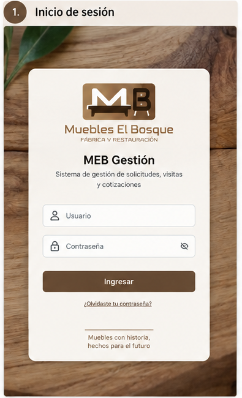
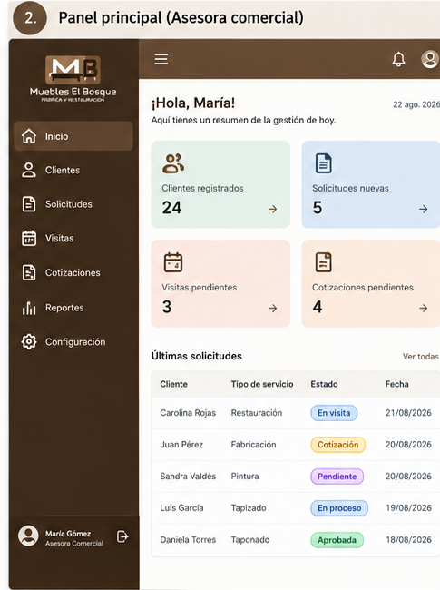
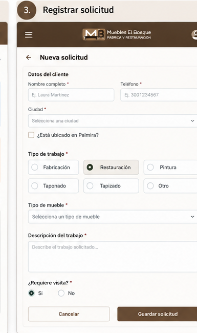
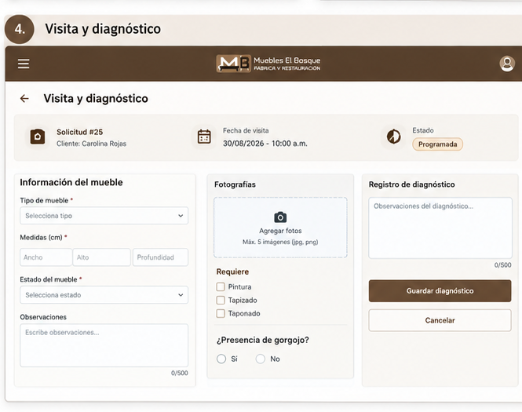
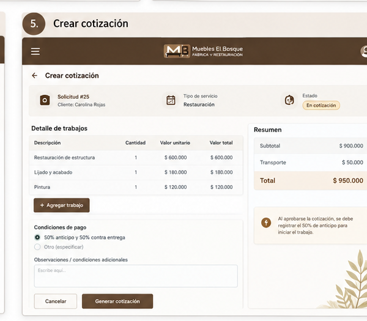

# MEB Gestión

## Sistema de gestión de solicitudes, visitas y cotizaciones para Muebles El Bosque

## 1. Propuesta

### Nombre del sistema

**MEB Gestión**

### Problema que resuelve

Muebles El Bosque recibe solicitudes de clientes principalmente por medio de redes sociales y WhatsApp. La información de cada cliente, el tipo de trabajo solicitado, las fotografías, las medidas, las observaciones de las visitas y las cotizaciones puede quedar distribuida entre diferentes conversaciones, fotografías, notas y documentos.

Esto dificulta centralizar la información y hacer seguimiento al proceso de atención de cada cliente.

MEB Gestión propone centralizar esta información para facilitar el seguimiento de las solicitudes desde el primer contacto hasta la elaboración y respuesta de la cotización.

### Tipos de usuarios

- **Asesora comercial:** registra clientes y solicitudes, coordina visitas, registra información, gestiona cotizaciones y actualiza los estados.
- **Trabajador especializado:** aporta la información técnica necesaria para elaborar la cotización según el trabajo requerido, por ejemplo restauración, pintura, tapizado o fabricación.
- **Cliente:** consulta la información de su solicitud y conoce el estado de su proceso.

### Alcance del sistema

#### El sistema SÍ hará

1. Registrar y gestionar clientes y sus solicitudes de servicio.
2. Registrar visitas, fotografías, medidas, características y observaciones sobre el mueble cuando sea necesario.
3. Crear, consultar y gestionar cotizaciones y registrar la respuesta del cliente.

#### El sistema NO hará

1. No procesará pagos en línea ni estará conectado a entidades bancarias.
2. No gestionará inventarios de materiales o productos.
3. No administrará todo el proceso de producción de los muebles, como maquinaria, nómina o control detallado de fabricación.

### Servicios contemplados

El sistema permitirá gestionar solicitudes relacionadas con:

- Fabricación
- Restauración
- Pintura
- Taponado
- Tapizado
- Otros trabajos


## 2. Backlog

### HU-01 - Registrar cliente

**Como** asesora comercial,  
**quiero** registrar los datos del cliente,  
**para** realizar seguimiento a su solicitud.

**Criterios de aceptación:**
- Registrar nombre del cliente.
- Registrar número de teléfono.
- Registrar ubicación.
- Indicar si el cliente se encuentra en Palmira.
- Asociar el cliente con una o varias solicitudes.

---

### HU-02 - Registrar solicitud

**Como** asesora comercial,  
**quiero** registrar la solicitud del cliente,  
**para** identificar qué tipo de trabajo necesita.

**Criterios de aceptación:**
- Seleccionar el tipo de servicio.
- Registrar el tipo de mueble.
- Registrar la descripción del trabajo solicitado.
- Asociar la solicitud con un cliente.
- Asignar un estado inicial a la solicitud.

---

### HU-03 - Determinar si requiere visita

**Como** asesora comercial,  
**quiero** indicar si una solicitud requiere visita,  
**para** organizar correctamente el proceso de atención.

**Criterios de aceptación:**
- Indicar si la solicitud requiere visita.
- Permitir continuar directamente a la cotización cuando no se requiere visita.
- Permitir programar una visita cuando sea necesaria.

---

### HU-04 - Programar visita y registrar diagnóstico

**Como** responsable de la visita,  
**quiero** programar la visita y registrar las características y condiciones del mueble,  
**para** disponer de la información necesaria para elaborar la cotización.

**Criterios de aceptación:**
- Registrar fecha y hora de la visita.
- Registrar dirección.
- Asociar la visita con una solicitud.
- Registrar medidas del mueble.
- Registrar tipo de artículo y estado.
- Registrar observaciones.
- Adjuntar fotografías.
- Registrar necesidades de pintura, tapizado o taponado.
- Registrar daños estructurales o presencia de gorgojo cuando corresponda.

---

### HU-05 - Crear cotización

**Como** asesora comercial,  
**quiero** elaborar una cotización con el apoyo del trabajador especializado,  
**para** presentar al cliente el valor del servicio.

**Criterios de aceptación:**
- Asociar la cotización con una solicitud.
- Registrar los trabajos requeridos.
- Registrar los valores correspondientes.
- Calcular el valor total.
- Registrar las condiciones de pago.
- Permitir generar la información necesaria para enviar la cotización al cliente.

---

### HU-06 - Registrar respuesta del cliente

**Como** asesora comercial,  
**quiero** registrar si el cliente acepta o rechaza la cotización,  
**para** actualizar el estado de la solicitud y registrar el anticipo requerido.

**Criterios de aceptación:**
- Registrar la cotización como aprobada o rechazada.
- Registrar la respuesta del cliente.
- Actualizar el estado de la solicitud.
- Cuando la cotización sea aprobada, calcular el 50 % correspondiente al anticipo.
- Registrar si el anticipo fue recibido.
- Identificar el 50 % restante pendiente.

---

### HU-07 - Consultar estado de la solicitud

**Como** cliente,  
**quiero** conocer el estado de mi solicitud,  
**para** saber en qué etapa se encuentra mi servicio.

**Criterios de aceptación:**
- Mostrar el estado actual de la solicitud.
- Mostrar la etapa del proceso.
- Permitir consultar la información básica de la solicitud.

---

## 3. Contrato de la API

La API permitirá gestionar la información principal del sistema MEB Gestión mediante recursos relacionados con clientes, solicitudes, visitas, diagnósticos y cotizaciones.

### Recurso: Clientes

#### POST /api/clientes

Permite registrar un nuevo cliente.

**Código de respuesta:** `201 Created`

**Ejemplo:**

```json
{
  "nombre": "María López",
  "telefono": "3001234567",
  "ciudad": "Palmira"
}


---

## 5. Bocetos de las pantallas

Los siguientes bocetos representan las principales pantallas propuestas para MEB Gestión, tomando como referencia el proceso comercial de Muebles El Bosque.

### 5.1 Inicio de sesión



### 5.2 Panel principal



### 5.3 Registro de solicitud



### 5.4 Visita y diagnóstico



### 5.5 Crear cotización


